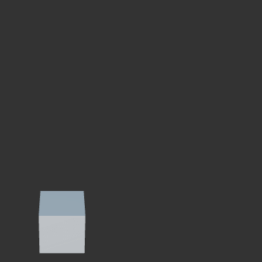

# QuickTween
简化CocosCreator中Tween的使用流程。参考了[DOTWeen](http://dotween.demigiant.com/index.php)。

## 更便利的创建tween
直接在相关对象的原型上polyfill了tween的创建

内置方式：
```ts
cc.tween(node).to(1, { position: new Vec(0, 3, 0)}).start();
```

使用QuickTween:
```ts
node.qtPosition(new Vec3(0, 3, 0), 1).start();
```

## 增加一些常用的组合Tween

例如：

### `qtJumpPosition`
用于从一个位置跳到另一个位置
```ts
node.qtJumpPosition(new Vec3(3, 1, 0), 3, 1, 1).start();
```



### `qtPunchScale`
用于对目标施加一个力，产生来回弹的效果
```ts
node.qtPunchScale(new Vec3(1, 1, 1), 1, 10, 1).start();
```


## 使用方式
将QuickTween文件夹复制到项目的任意文件夹下，就可以使用了。